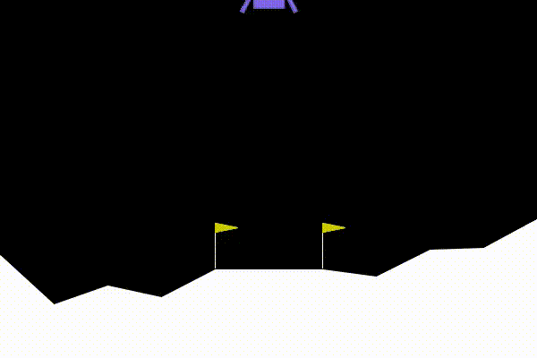
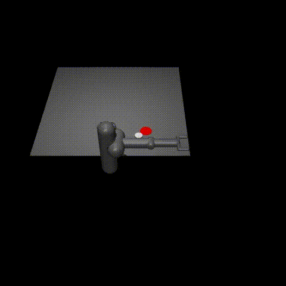

# PPO Reinforcement Learning on OpenAI Gym

This project implements the Proximal Policy Optimization (PPO) algorithm using the `stable-baselines3` library to solve various environments from the OpenAI Gym suite.

## Environments 

- Bipedal Walker
- Car Racing
- Lunar Lander
- Pusher
- Humanoid

## Training Details

All environments were trained using PPO on a CPU, with the exception of Car Racing. Due to its CNN-based policy, Car Racing was trained using CUDA.

### Lunar Lander

### Pusher

### Bipedal Walker

### Car Racing

The input to the network is the last 3 game frames of size 96x96x3. By episode ~70, The agent is able to follow the track but skids at sharp turns. 

### Humanoid

